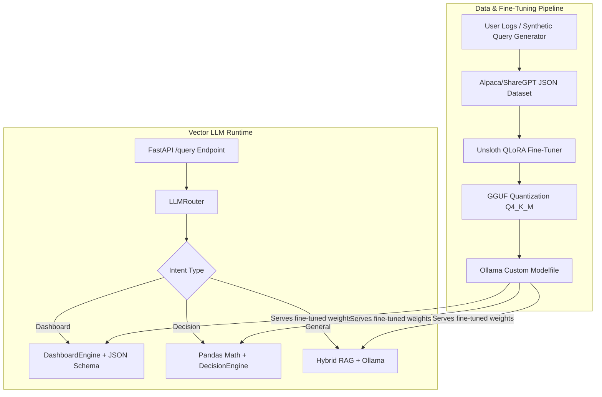

# LLM Optimization & Fine-Tuning Strategy for Vector Microservice

## Executive Summary

The `vector-llm` microservice is currently structured as a local multi-engine intelligence service powered by **Ollama**, **ChromaDB**, **FastAPI**, and custom engines for intent routing, statistical decision generation, and Plotly.js visualization.

Currently:
- **Generative Model**: `phi3` / `mistral` (7B parameter base/instruct models).
- **Embedding Model**: `nomic-embed-text`.
- **RAG Technique**: Basic fixed-word chunking (400 words) with cosine distance filtering in ChromaDB.
- **Structured Output**: Regex-based JSON stripping from raw model outputs.
- **Fine-Tuning Status**: None yet (relying solely on zero-shot/few-shot system prompts).

To achieve **state-of-the-art accuracy, speed, and reliability**, we must upgrade both the **model pipeline** (base model selection + domain QLoRA fine-tuning) and the **RAG & system architecture** (structured JSON enforcement, hybrid retrieval, dataset generation pipeline).

---

## User Review Required

> [!IMPORTANT]
> **Hardware & Environment Considerations for Fine-Tuning**
> Fine-tuning a 7B-8B parameter model (like Llama 3.1 8B or Qwen 2.5 7B) using QLoRA requires an NVIDIA GPU with at least 8GB-12GB VRAM (or Google Colab T4/A100 GPU).
> Once fine-tuned, the model is exported to `.gguf` format and imported directly into your local Ollama server via `ollama create vector-llm-custom -f Modelfile`.

> [!TIP]
> **Model Recommendation (2025/2026 SOTA)**
> - **Primary Recommendation**: **`qwen2.5:7b`** or **`qwen2.5-coder:7b`** — Exceptionally strong at JSON schema compliance, structured code generation, and tabular reasoning. Outperforms Mistral/Phi3 by 15-20% on structured data tasks.
> - **Alternative for Reasoning**: **`deepseek-r1:8b`** or **`llama3.1:8b`** — Superior general reasoning and concise text generation.

---

## Architecture & Optimization Strategy (5 Pillars)



---

## Proposed Changes

### Pillar 1: Model Selection & Upgrade Config

#### [MODIFY] [config.py](file:///d:/MIS/MISVECTOR/vector-llm-changes-testing/vector-llm/config.py)
- Upgrade default model to `qwen2.5:7b` or `llama3.1:8b`.
- Add temperature presets per intent (e.g. `0.0` for structured JSON engines, `0.3` for general questions).
- Add support for Ollama JSON schema parameter.

#### [MODIFY] [.env](file:///d:/MIS/MISVECTOR/vector-llm-changes-testing/vector-llm/.env)
- Update default model variables and timeout settings.

---

### Pillar 2: End-to-End Domain Fine-Tuning Pipeline

We will build a dedicated dataset preparation and fine-tuning pipeline tailored specifically for `vector-llm` tasks:

1. **Task 1: Query Intent Classification** (Mapping user queries to `dashboard`, `decision`, `question`, `forecast`, `summary`).
2. **Task 2: Plotly Chart Spec Generation** (Extracting real data arrays and mapping to valid Plotly JSON specs with sharp insights).
3. **Task 3: Business Recommendation Synthesis** (Reading pandas statistical tables and outputting structured decision recommendations with risk/metrics).

#### [NEW] [tools/dataset_builder.py](file:///d:/MIS/MISVECTOR/vector-llm-changes-testing/vector-llm/tools/dataset_builder.py)
- Generates high-quality synthetic training pairs (Alpaca/ShareGPT format) for training the local model on exact Plotly specs and decision formats.
- Prepares `train.jsonl` and `val.jsonl` datasets.

#### [NEW] [tools/finetune_unsloth.py](file:///d:/MIS/MISVECTOR/vector-llm-changes-testing/vector-llm/tools/finetune_unsloth.py)
- PyTorch + Unsloth (or HuggingFace TRL) script to train a 4-bit QLoRA adapter on `Qwen/Qwen2.5-7B-Instruct` or `meta-llama/Llama-3.1-8B-Instruct`.
- Merges LoRA weights and converts model to `gguf` format (`q4_k_m`).

#### [NEW] [tools/Modelfile](file:///d:/MIS/MISVECTOR/vector-llm-changes-testing/vector-llm/tools/Modelfile)
- Ollama Modelfile definition to register the fine-tuned model as `vector-llm:v1` in Ollama.

---

### Pillar 3: Ollama Client & Structured JSON Schema Enforcement

#### [MODIFY] [llm/ollama.py](file:///d:/MIS/MISVECTOR/vector-llm-changes-testing/vector-llm/llm/ollama.py)
- Support Ollama's native `format="json"` or `format=pydantic_schema` parameter in `/api/generate` payload to force 100% syntactically valid JSON responses.
- Pass custom temperature per call (`temperature=0.0` for structured tasks).

---

### Pillar 4: RAG Quality & Semantic Chunking Improvements

#### [MODIFY] [llm/rag.py](file:///d:/MIS/MISVECTOR/vector-llm-changes-testing/vector-llm/llm/rag.py)
- Implement **CSV/Tabular Aware Chunking** and **Markdown Header Chunking** instead of pure word counts (which cuts tables mid-row).
- Add metadata filtering and distance threshold tuning.
- Add optional hybrid keyword/vector scoring.

---

### Pillar 5: System Prompts & Few-Shot Exemplars

#### [MODIFY] [llm/dashboard_engine.py](file:///d:/MIS/MISVECTOR/vector-llm-changes-testing/vector-llm/llm/dashboard_engine.py)
- Add few-shot JSON exemplars in `DASHBOARD_PROMPT` to guide the model on Plotly chart structure.
- Add strict validation checks for `x` and `y` array consistency.

#### [MODIFY] [llm/decision_engine.py](file:///d:/MIS/MISVECTOR/vector-llm-changes-testing/vector-llm/llm/decision_engine.py)
- Improve `DECISION_PROMPT` with clear guidance on referencing exact statistics from pandas output.

---

## Step-by-Step Implementation Roadmap

| Phase | Description | Deliverables |
| :--- | :--- | :--- |
| **Phase 1: Codebase Upgrades** | Native JSON mode, updated models, improved RAG chunking, few-shot prompts. | Modified `ollama.py`, `config.py`, `rag.py`, `dashboard_engine.py`, `decision_engine.py`. |
| **Phase 2: Fine-Tuning Pipeline** | Dataset generator tool + Unsloth QLoRA script + Ollama Modelfile export guide. | `tools/dataset_builder.py`, `tools/finetune_unsloth.py`, `tools/Modelfile`. |
| **Phase 3: Fine-Tuning Execution** | Generate dataset, train QLoRA, export GGUF, register in Ollama. | Fine-tuned `vector-llm:v1` model in Ollama. |
| **Phase 4: Verification & Benchmarking** | Run test suite, verify latency, intent classification accuracy, and Plotly chart JSON valid rate. | Passing `pytest` suite + benchmark report. |

---

## Verification Plan

### Automated Tests
- Run `pytest` on the test suite:
  ```powershell
  cd d:\MIS\MISVECTOR\vector-llm-changes-testing\vector-llm
  pytest -v
  ```
- Test structured JSON parsing rate on synthetic dataset (verifying 100% valid JSON returns).

### Manual Verification
- Test `GET /health` to verify model status.
- Issue `/dashboard` and `/decide` requests to verify output quality and confidence score improvements.
